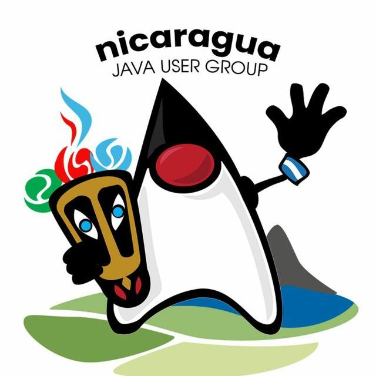

## Hello World
Explain here how to use the project. Include code examples and screenshots if necessary.

## Contributing

Explain here how to contribute to the project. Include information about the code style, the process to submit pull requests, etc.

## License

Include information about the project's license here.

This is a link [main](help/poc.md)

This is an image 

Another image 
